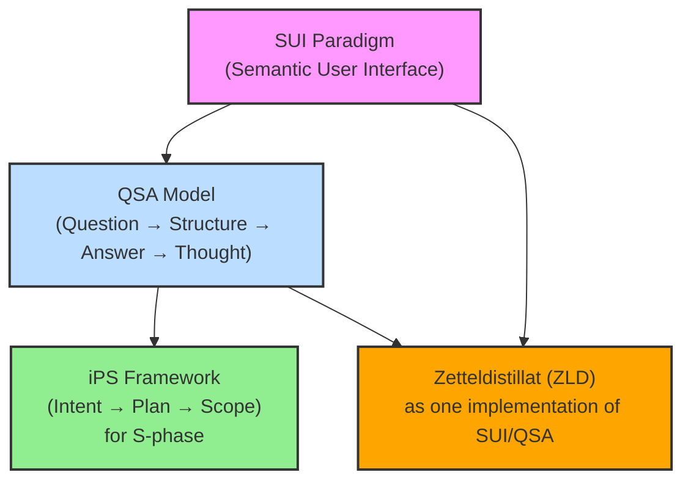

# Overview of Concepts / 概念の概要

This section provides a bird's-eye view of the core concepts presented in this repository and their relationships.
（本セクションでは、このリポジトリで提示される主要な概念とその関係性について概観します。）

## Key Documents in this Section / 本セクションの主要ドキュメント

- **[`concept_overview.md`](./concept_overview.md):** A detailed explanation of the **QSA (Question → Structure → Answer → Thought) Model**. This is a foundational document for understanding the core cognitive protocol.
    （**QSA（問い→構造→答え→思考）モデル**の詳細な解説。コアとなる認知プロトコルを理解するための基礎ドキュメントです。）
- **[`philosophy_of_intelligence.md`](./philosophy_of_intelligence.md):** Explores the **philosophical basis** of our approach, viewing intelligence as a cyclical process of information compression and meaning expansion. This philosophy underpins both SUI and QSA.
    （我々のアプローチの**哲学的基盤**を探求し、知性を情報の圧縮と意味の展開の循環プロセスとして捉えます。この哲学はSUIとQSA双方の根底にあります。）

## Conceptual Hierarchy and Relationships / 概念階層と関係性

The following diagram illustrates the hierarchical relationship between the SUI paradigm, the QSA model, the iPS framework, and the Zetteldistillat (ZLD) implementation.
（以下の図は、SUIパラダイム、QSAモデル、iPSフレームワーク、そしてZetteldistillat（ZLD）実装の間の階層関係を示しています。）

- **SUI (Semantic User Interface) Paradigm:** The broadest conceptual framework for human-AI co-thinking. It defines *how* we interact with intelligent systems based on meaning.
    （人間とAIの共同思考のための最も広範な概念的枠組み。意味に基づいて知的システムと*どのように*対話するかを定義します。）
    - See: [`../10_sui/sui_concept.md`](../10_sui/sui_concept.md)
- **QSA (Question → Structure → Answer → Thought) Model:** A specific, structured, and recursive protocol that operates *within* the SUI paradigm. It provides a concrete workflow for inquiry and knowledge evolution.
    （SUIパラダイム*内*で動作する、具体的で構造化された再帰的プロトコル。探求と知識進化のための具体的なワークフローを提供します。）
    - See: [`./concept_overview.md`](./concept_overview.md) and [`../20_qsa/README.md`](../20_qsa/README.md)
- **iPS (Intent → Plan → Scope) Framework:** A lightweight guideline designed to assist in formulating the **Structure (S)** phase of the QSA model effectively.
    （QSAモデルの**構造（S）**フェーズを効果的に策定するのを支援するために設計された軽量ガイドライン。）
    - See: [`../30_qsa_extensions/ips_framework.md`](../30_qsa_extensions/ips_framework.md)
- **Zetteldistillat (ZLD):** One practical implementation strategy for the SUI paradigm, utilizing QSA principles for managing and distilling knowledge from atomic notes (Zettels).
    （SUIパラダイムの一つの実践的実装戦略であり、原子的なノート（ツェッテル）から知識を管理・蒸留するためにQSA原則を活用します。）
    - See: [`../40_implementations/zld/loop-04_zd-core-principles.md`](../40_implementations/zld/loop-04_zd-core-principles.md)

Understanding these relationships is key to navigating the concepts within this repository.
（これらの関係性を理解することが、本リポジトリ内の概念を理解する上での鍵となります。）
